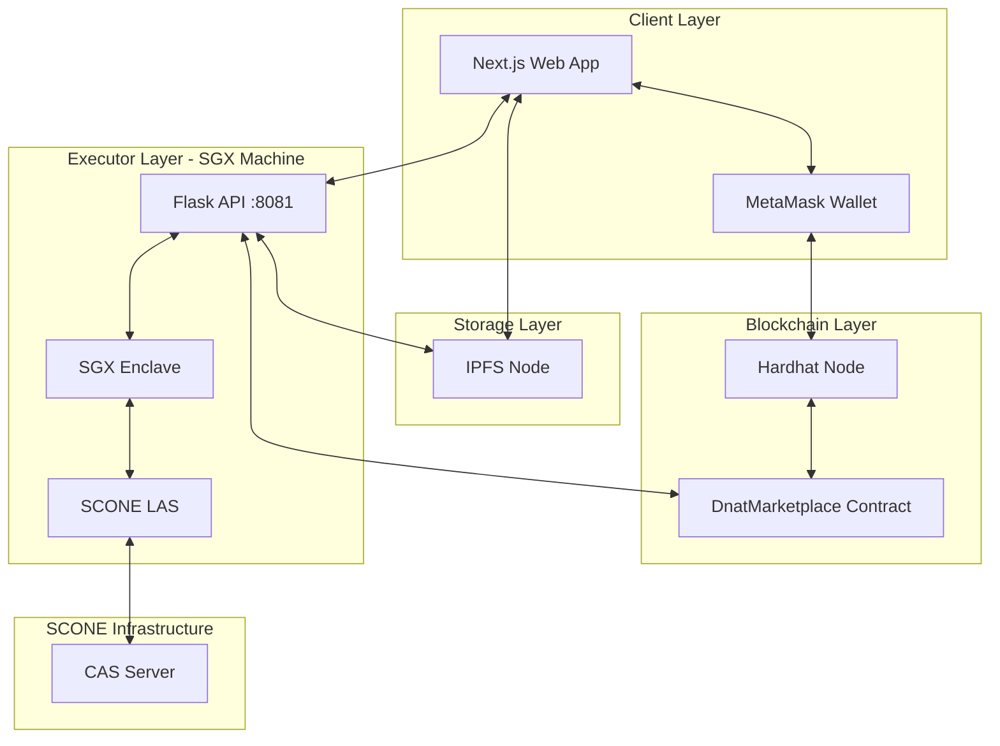
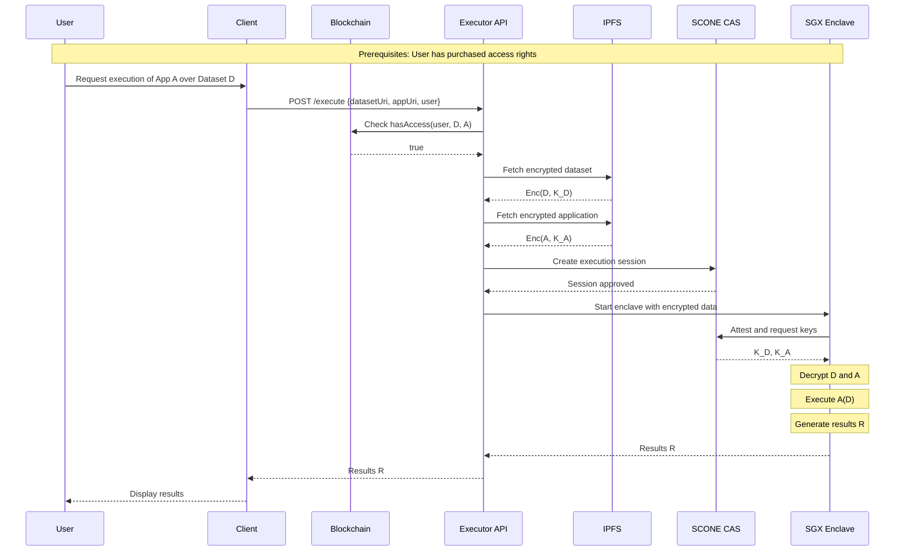
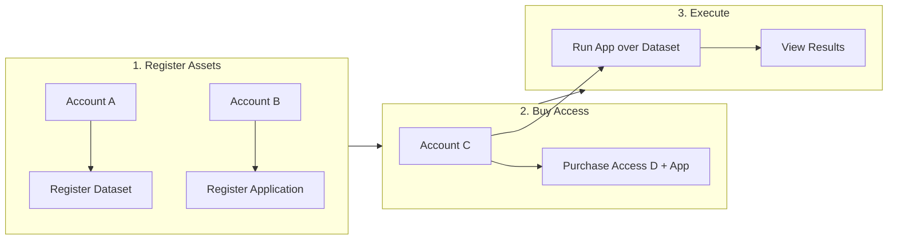

# DNAT - Decentralized Non-fungible Access Token Marketplace

A confidential data marketplace that enables secure execution of applications over encrypted datasets using Intel SGX enclaves, Ethereum smart contracts, and SCONE trusted execution.

> **Author:** [davihsg](https://github.com/davihsg)  
> **Special Thanks:** Andrey Brito (UFCG) and Amândio Ferreira (SCONE/Scontain)

## Warnings

| | |
|---|---|
| **Not Production Ready** | This system is a proof-of-concept and should not be used in production environments. |
| **Vibecoded** | This project was largely developed with AI assistance (Cursor). It may contain vulnerabilities. Run in a safe, isolated environment. |
| **SGX Required** | The executor requires an Intel SGX-enabled machine with proper drivers. |

## Overview

DNAT implements a marketplace where:

1. **Data/App Providers** register encrypted assets (datasets or applications) and set prices
2. **Users** purchase access rights to run specific applications over specific datasets
3. **Execution** happens inside SGX enclaves, ensuring only the enclave sees plaintext data

The system ensures that raw data never leaves the secure enclave, while still allowing monetization through blockchain-based access control.

## Architecture



### Component Roles

| Component | Description |
|-----------|-------------|
| **Web Client** | Next.js app for asset registration, access purchase, and execution requests |
| **MetaMask** | Wallet for signing transactions and switching between accounts |
| **Hardhat** | Local Ethereum blockchain for development |
| **DnatMarketplace** | Solidity smart contract managing assets, prices, and access rights |
| **IPFS** | Distributed storage for encrypted assets and manifests |
| **Executor API** | Flask server that orchestrates enclave execution |
| **SGX Enclave** | Trusted execution environment that decrypts and runs code |
| **LAS** | SCONE Local Attestation Service for enclave verification |
| **CAS** | SCONE Configuration and Attestation Service for key management |

## Execution Flow



## Prerequisites

Before running DNAT, ensure you have:

- **SGX-enabled machine** with:
  - `/dev/sgx_enclave` device
  - `/dev/sgx_provision` device
- **SCONE GitLab access**: [https://gitlab.scontain.com/](https://gitlab.scontain.com/)
  - Required to pull SCONE images from `registry.scontain.com`
- **Docker** and **Docker Compose**
- **Node.js** v18 or higher
- **Python** 3.10+
- **Browser** with MetaMask extension

### SCONE Registry Login

```bash
docker login registry.scontain.com
# Enter your SCONE GitLab credentials
```

## Setup

> **Note:** This setup assumes all components run on the same SGX-enabled machine.

### Step 1: Start the Blockchain (Hardhat)

```bash
cd executor
docker compose up hardhat -d
```

Wait a few seconds, then check the logs:

```bash
docker compose logs hardhat
```

Look for the test accounts with their private keys:

```
Account #0: 0xf39Fd6e51aad88F6F4ce6aB8827279cffFb92266 (10000 ETH)
Private Key: 0xac0974bec39a17e36ba4a6b4d238ff944bacb478cbed5efcae784d7bf4f2ff80

Account #1: 0x70997970C51812dc3A010C7d01b50e0d17dc79C8 (10000 ETH)
Private Key: 0x59c6995e998f97a5a0044966f0945389dc9e86dae88c7a8412f4603b6b78690d

Account #2: 0x3C44CdDdB6a900fa2b585dd299e03d12FA4293BC (10000 ETH)
Private Key: 0x5de4111afa1a4b94908f83103eb1f1706367c2e68ca870fc3fb9a804cdab365a
```

**Add accounts to MetaMask:**

1. Open MetaMask > Account icon > "Add account or hardware wallet"
2. Select "Import account"
3. Paste the private key (e.g., `0xac0974bec39a17e36ba4a6b4d238ff944bacb478cbed5efcae784d7bf4f2ff80`)
4. Repeat for 2-3 accounts

**Configure Hardhat network in MetaMask:**

1. Click the network selector in MetaMask
2. "Add network" > "Add a network manually"
3. Fill in:
   - **Network Name:** Hardhat Localhost
   - **RPC URL:** `http://localhost:8545`
   - **Chain ID:** `31337`
   - **Currency Symbol:** ETH

### Step 2: Deploy the Smart Contract

```bash
cd smart-contract
npm install
npm run deploy:localhost
```

Expected output:

```
Deploying contracts with account: 0xf39Fd6e51aad88F6F4ce6aB8827279cffFb92266
DnatMarketplace deployed to: 0x5FbDB2315678afecb367f032d93F642f64180aa3
```

> **Note:** The default contract address `0x5FbDB2315678afecb367f032d93F642f64180aa3` is already configured in the client and executor. If your deployment produces a different address, update:
> - `client/src/config/contract.ts`
> - `executor/run-api.sh` (CONTRACT_ADDRESS variable)

### Step 3: Start IPFS

```bash
cd executor
docker compose up -d ipfs
```

Verify it's running:

```bash
curl http://localhost:5001/api/v0/id
```

### Step 4: Start LAS (Local Attestation Service)

> **Requires SGX hardware**

```bash
cd executor
docker compose up -d las
```

The LAS container needs access to SGX devices. Verify your machine has:

```bash
ls -la /dev/sgx*
# Should show: /dev/sgx_enclave and /dev/sgx_provision
```

### Step 5: Build the Enclave Image

```bash
cd executor
docker compose build enclave
```

This builds the `dnat-enclave` image using SCONE's Python SGX image.

### Step 6: Start the Executor API

> **Note:** The API runs outside Docker to spawn enclave containers.

```bash
cd executor
pip3 install -r api/requirements.txt
bash run-api.sh
```

The API will start on port `8081`. You should see:

```
Starting Executor API on port 8081
Blockchain RPC: http://localhost:8545
IPFS Gateway: http://localhost:8080/ipfs
Enclave Image: dnat-enclave
SCONE CAS: scone-cas.cf
SCONE LAS: localhost
```

### Step 7: Start the Web Client

From the **project root**:

```bash
docker compose up -d client
```

The client will be available at [http://localhost:3000](http://localhost:3000)

## Running the System

### Workflow Diagram



### 1. Registering Assets

#### Register a Dataset (Account A)

1. Connect to the client at [http://localhost:3000](http://localhost:3000)
2. Connect MetaMask with **Account A**
3. Navigate to **"Register Asset"**
4. Fill in:
   - **Asset Type:** Dataset (CSV format)
   - **File:** Upload `examples/computer_theory_grades.csv` or `examples/exercise_frequency.csv`
   - **Name:** e.g., "Computer Theory Grades"
   - **Description:** Brief description of the dataset
   - **Price:** e.g., 0.01 ETH
5. Click **"Register Asset"**
6. Approve the transaction in MetaMask

#### Register an Application (Account B)

1. Switch to **Account B** in MetaMask
2. Navigate to **"Register Asset"**
3. Fill in:
   - **Asset Type:** Application (Python)
   - **File:** Upload `examples/applications/linear_regression_trainer.py`
   - **Name:** e.g., "Linear Regression Trainer"
   - **Description:** Brief description
   - **Price:** e.g., 0.005 ETH
4. Click **"Register Asset"**
5. Approve the transaction in MetaMask

### 2. Buying Access Rights

1. Switch to **Account C** in MetaMask
2. Navigate to **"Purchase Access"**
3. Select the **Dataset** you registered (from Account A)
4. Select the **Application** you registered (from Account B)
5. Review the total price (Dataset price + Application price)
6. Click **"Purchase Access"**
7. Approve the transaction in MetaMask

> **Note:** The ETH will be transferred to both the dataset owner (Account A) and application owner (Account B).

### 3. Executing the Application

1. Stay connected with **Account C**
2. Navigate to **"My Access Rights"** or **"Execute"**
3. Select the access right you purchased
4. Click **"Execute"**
5. Wait for the enclave to:
   - Fetch encrypted assets from IPFS
   - Attest with CAS and retrieve decryption keys
   - Decrypt and run the application
   - Return results
6. View the execution results on screen

## Ports Reference

| Service | Port | Description |
|---------|------|-------------|
| Web Client | 3000 | Next.js frontend |
| Hardhat RPC | 8545 | Ethereum JSON-RPC |
| IPFS Gateway | 8080 | Read encrypted assets |
| IPFS API | 5001 | Upload assets |
| Executor API | 8081 | Execution requests |
| LAS | 18766 | SCONE attestation |

## Project Structure

```
dnat/
├── README.md                 # This file
├── docker-compose.yaml       # Client orchestration
├── docs/
│   ├── artigo.pdf           # Research paper
│   └── knowledge.md         # Design documentation
├── smart-contract/
│   ├── contracts/
│   │   └── DnatMarketplace.sol
│   ├── scripts/
│   │   └── deploy.js
│   └── package.json
├── executor/
│   ├── docker-compose.yaml  # Executor stack (Hardhat, IPFS, LAS)
│   ├── api/
│   │   ├── app.py          # Flask API
│   │   └── requirements.txt
│   ├── enclave/
│   │   ├── Dockerfile      # SCONE Python image
│   │   └── execute.py      # Enclave execution script
│   └── run-api.sh          # API startup script
├── client/
│   ├── src/
│   │   ├── app/            # Next.js pages
│   │   ├── components/     # React components
│   │   ├── services/       # CAS, executor clients
│   │   └── config/         # Contract addresses, ABI
│   └── package.json
└── examples/
    ├── computer_theory_grades.csv
    ├── exercise_frequency.csv
    └── applications/
        ├── linear_regression_trainer.py
        └── ...
```

## Known Limitations

### 1. CAS Policy Design

The current implementation creates a nested policy that imports secrets from multiple sessions into a single execution session. This approach simplifies development but is **not secure for production**. The original DNAT paper uses a more sophisticated key derivation scheme.

### 2. Application Whitelist

The smart contract includes a `bloomFilter` field for dataset providers to whitelist applications that can access their data for free. This feature is **not implemented** in the current executor.

### 3. Revocation

While the smart contract supports `revokeAsset()`, the executor does not enforce revocation checks. Previously granted access rights remain valid.

### 4. Single Machine Setup

This guide assumes all components run on the same machine. For distributed setups, you'll need to:
- Configure SSH tunnels for cross-machine communication
- Update RPC URLs and environment variables accordingly

### 5. Limited Application Support

The enclave uses a pre-built SCONE Python image with limited packages:
- pandas, numpy, scipy, matplotlib, pycryptodome
- Adding new packages requires rebuilding the enclave image

## References

- [SCONE Documentation](https://sconedocs.github.io/)
- [Hardhat Documentation](https://hardhat.org/docs)
- [IPFS Documentation](https://docs.ipfs.tech/)
- [Intel SGX](https://www.intel.com/content/www/us/en/developer/tools/software-guard-extensions/overview.html)

## License

MIT License

## Acknowledgments

- **Andrey Brito** - Professor at UFCG, research advisor
- **Amândio Ferreira** - SCONE/Scontain, helped configure SCONE infrastructure
- **SCONE Team** - For the trusted execution framework
